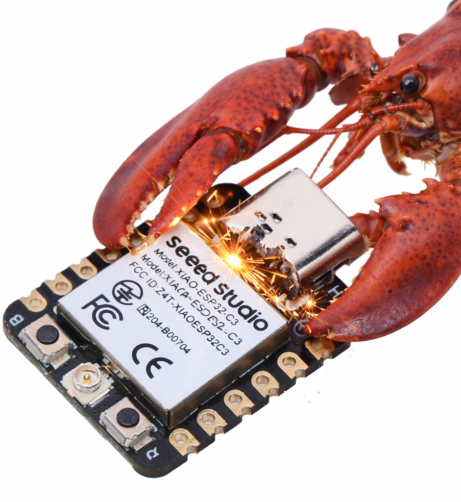

# IoT Agents

ESP32 AI firmware with sensor monitoring, threshold alerts, and cloud logging —
built on top of [zclaw](https://github.com/tnm/zclaw) by Ted Nyman.

> **Based on zclaw** — original firmware core (LLM, Telegram, GPIO, cron, NVS) unchanged.
> This project adds: sensor abstraction layer, BME280 driver, heartbeat task, and cloud logging.



The smallest possible AI IoT agent for ESP32.

zclaw is written in C and runs on ESP32 boards with a strict all-in firmware budget target of **<= 888 KiB** on the default build. It supports scheduled tasks, GPIO control, persistent memory, and custom tool composition through natural language.

The **888 KiB** cap is all-in firmware size, not just app code.
It includes `zclaw` logic plus ESP-IDF/FreeRTOS runtime, Wi-Fi/networking, TLS/crypto, and cert bundle overhead.

Fun to use, fun to hack on.
<br clear="right" />

## What's New in IoT Agents

### Sensor Abstraction Layer

Multi-sensor support via an X-macro registry pattern — adding a new sensor takes one driver file (~100 lines) and one registry entry.

| Sensor | Interface | Address | Measurements |
|--------|-----------|---------|--------------|
| BME280 | I2C | 0x76 | Temperature, Humidity, Pressure |
| MPU-6050 | I2C | 0x68 | Accelerometer, Gyroscope _(stub)_ |

**Telegram commands:**
```
"list sensors"              → show all registered sensors and status
"read sensor bme280"        → temp=28.5°C, humidity=72%, pressure=1013hPa
```

### BME280 Wiring (ESP32-S3)

```
BME280        ESP32-S3
-------       --------
VCC    →      3.3V
GND    →      GND
SDA    →      GPIO 8
SCL    →      GPIO 9
SDO    →      GND  (sets I2C address to 0x76)
```

### Heartbeat — Autonomous Threshold Alerts

A FreeRTOS background task reads all sensors every N minutes and fires Telegram alerts automatically — no LLM call needed unless a threshold is crossed.

**Set up rules via Telegram:**
```
"แจ้งฉันถ้าอุณหภูมิเกิน 35°C"
→ AI calls heartbeat_add_rule: "bme280.temp_c > 35 : ห้องร้อนเกิน 35°C"

"แจ้งถ้าความชื้นต่ำกว่า 40%"
→ AI calls heartbeat_add_rule: "bme280.humidity_pct < 40 : ความชื้นต่ำ"

"ตรวจสอบทุก 10 นาที"
→ AI calls heartbeat_set_interval: {"minutes": 10}

"ดู rules ทั้งหมด"
→ heartbeat_list_rules

"ลบ rule 0"
→ heartbeat_delete_rule: {"index": 0}
```

Rule format: `sensor.field op value : alert message`
Operators: `>`, `<`, `>=`, `<=`, `==`
Each rule fires **once** when the condition becomes true, then resets when it clears.

### Cloud Logging (Optional)

HTTP POST sensor data to any endpoint on every heartbeat cycle. Works without cloud — heartbeat alerts function independently.

**Enable via Telegram:**
```
"ตั้ง cloud endpoint เป็น https://example.com/sensor"
→ AI calls cloud_set_endpoint

"push sensor data ไป cloud เดี๋ยวนี้"
→ AI calls cloud_push_now

"ปิด cloud logging"
→ AI calls cloud_clear_endpoint
```

**Or enable at provision time:**
```bash
./scripts/provision.sh ... \
  --cloud-url https://example.com/sensor \
  --cloud-key "mytoken"   # optional Bearer token
```

**JSON payload:**
```json
{"sensor":"bme280","ts":1720000000,"temp_c":28.5,"humidity_pct":72.1,"pressure_hpa":1013.2}
```

Failed POSTs are queued in a ring buffer (8 entries) and retried on the next heartbeat cycle.

### LM Studio (Local LLM)

Model is **auto-detected** at boot via `GET /v1/models` — no need to pin a model name. Just set the API URL:

```bash
./scripts/provision.sh \
  --backend openai \
  --api-key lm-studio \
  --api-url http://192.168.1.40:1234/v1/chat/completions \
  --skip-api-check
```

Switch models in LM Studio → restart ESP32 → new model is picked up automatically.

### Adding a New Sensor

Three steps, ~100 lines total:

```c
// 1. Write driver: main/sensors/sensor_xxx.c
bool xxx_init(void) { /* init I2C device */ }
bool xxx_read(sensor_data_t *out) { /* read + fill out */ }

// 2. Register — one line in main/sensors/sensor_registry.h
SENSOR_ENTRY("xxx", "Description", xxx_init, xxx_read)

// 3. Test via Telegram
"read sensor xxx"
```

---

## Full Documentation

Use the docs site for complete guides and reference.

- [Full documentation](https://zclaw.dev)
- [Use cases: useful + fun](https://zclaw.dev/use-cases.html)
- [Changelog (web)](https://zclaw.dev/changelog.html)
- [Complete README (verbatim)](https://zclaw.dev/reference/README_COMPLETE.md)


## Quick Start

One-line bootstrap (macOS/Linux):

```bash
bash <(curl -fsSL https://raw.githubusercontent.com/tnm/zclaw/main/scripts/bootstrap.sh)
```

Already cloned?

```bash
./install.sh
```

Non-interactive install:

```bash
./install.sh -y
```

<details>
<summary>Setup notes</summary>

- `bootstrap.sh` clones/updates the repo and then runs `./install.sh`. You can inspect/verify the bootstrap flow first (including `ZCLAW_BOOTSTRAP_SHA256` integrity checks); see the [Getting Started docs](https://zclaw.dev/getting-started.html).
- Linux dependency installs auto-detect `apt-get`, `pacman`, `dnf`, or `zypper` during `install.sh` runs.
- In non-interactive mode, unanswered install prompts default to `no` unless you pass `-y` (or saved preferences/explicit flags apply).
- For encrypted credentials in flash, use secure mode (`--flash-mode secure` in install flow, or `./scripts/flash-secure.sh` directly).
- After flashing, provision WiFi + LLM credentials with `./scripts/provision.sh`.
- You can re-run either `./scripts/provision.sh` or `./scripts/provision-dev.sh` at any time (no reflash required) to update runtime credentials: WiFi SSID/password, LLM backend/model/API key (or Ollama API URL), and Telegram token/chat ID allowlist.
- Default LLM rate limits are `100/hour` and `1000/day`; change compile-time limits in `main/config.h` (`RATELIMIT_*`).
- Quick validation path: run `./scripts/web-relay.sh` and send a test message to confirm the device can answer.
- If serial port is busy, run `./scripts/release-port.sh` and retry.
- For repeat local reprovisioning without retyping secrets, use `./scripts/provision-dev.sh` with a local profile file (`provision-dev.sh` wraps `provision.sh --yes`).

</details>

## Highlights

**IoT Agents additions:**
- BME280 sensor (temperature, humidity, pressure) via I2C
- Autonomous heartbeat loop — threshold alerts sent to Telegram without polling
- Cloud logging via HTTP POST with ring-buffer retry
- LM Studio auto-detect model at boot (no model pin required)
- Extensible sensor registry — add a new sensor in ~100 lines

**zclaw base:**
- Chat via Telegram or hosted web relay
- Timezone-aware schedules (`daily`, `periodic`, and one-shot `once`)
- Built-in + user-defined tools
- Runtime diagnostics via `get_diagnostics` (quick/runtime/memory/rates/time/all scopes)
- GPIO read/write control with guardrails (including bulk `gpio_read_all`)
- Persistent memory across reboots
- Persona options: `neutral`, `friendly`, `technical`, `witty`
- Provider support for Anthropic, OpenAI, OpenRouter, and Ollama (custom endpoint)

## Hardware

Primary target: **ESP32-S3 DevKit** — tested with sensor layer and heartbeat task.
Also supported: **ESP32-C3**, **ESP32**, **ESP32-C6**.

Recommended starter board: [Seeed XIAO ESP32-C3](https://www.seeedstudio.com/Seeed-XIAO-ESP32C3-p-5431.html)

Build for ESP32-S3 (primary):
```bash
. ~/esp/esp-idf/export.sh
idf.py set-target esp32s3
idf.py build
idf.py -p /dev/ttyACM0 flash
```

Build for ESP32-C3:
```bash
idf.py set-target esp32c3
idf.py build
idf.py -p /dev/ttyACM0 flash
```

## Local Dev & Hacking

Typical fast loop:

```bash
./scripts/test.sh host
./scripts/build.sh
./scripts/flash.sh --kill-monitor /dev/cu.usbmodem1101
./scripts/provision-dev.sh --port /dev/cu.usbmodem1101
./scripts/monitor.sh /dev/cu.usbmodem1101
```

Profile setup once, then re-use:

```bash
./scripts/provision-dev.sh --write-template
# edit ~/.config/zclaw/dev.env
./scripts/provision-dev.sh --show-config
./scripts/provision-dev.sh

# if Telegram keeps replaying stale updates:
./scripts/telegram-clear-backlog.sh --show-config
```

More details in the [Local Dev & Hacking guide](https://zclaw.dev/local-dev.html).

### Other Useful Scripts

<details>
<summary>Show scripts</summary>

- `./scripts/flash-secure.sh` - Flash with encryption
- `./scripts/provision.sh` - Provision credentials to NVS
- `./scripts/provision-dev.sh` - Local profile wrapper for repeat provisioning
- `./scripts/telegram-clear-backlog.sh` - Clear queued Telegram updates
- `./scripts/erase.sh` - Erase NVS only (`--nvs`) or full flash (`--all`) with guardrails
- `./scripts/monitor.sh` - Serial monitor
- `./scripts/emulate.sh` - Run QEMU profile
- `./scripts/web-relay.sh` - Hosted relay + mobile chat UI
- `./scripts/benchmark.sh` - Benchmark relay/serial latency
- `./scripts/test.sh` - Run host/device test flows
- `./scripts/test-api.sh` - Run live provider API checks (manual/local)

</details>

## Size Breakdown

Current default `esp32s3` breakdown (grouped loadable image bytes from `idf.py -B build size-components`; rows sum to total image size):

| Segment | Bytes | Size | Share |
| --- | ---: | ---: | ---: |
| zclaw app logic (`libmain.a`) | `35742` | ~34.9 KiB | ~4.1% |
| Wi-Fi + networking stack | `397356` | ~388.0 KiB | ~45.7% |
| TLS/crypto stack | `112922` | ~110.3 KiB | ~13.0% |
| cert bundle + app metadata | `99722` | ~97.4 KiB | ~11.5% |
| other ESP-IDF/runtime/drivers/libc | `224096` | ~218.8 KiB | ~25.8% |

Total image size from this build is `869838` bytes; padded `zclaw.bin` is `869952` bytes (~849.6 KiB), still under the cap.

## Latency Benchmarking

Relay path benchmark (includes web relay processing + device round trip):

```bash
./scripts/benchmark.sh --mode relay --count 20 --message "ping"
```

Direct serial benchmark (host round trip + first response time). If firmware logs
`METRIC request ...` lines, the report also includes device-side timing:

```bash
./scripts/benchmark.sh --mode serial --serial-port /dev/cu.usbmodem1101 --count 20 --message "ping"
```

## License

MIT
